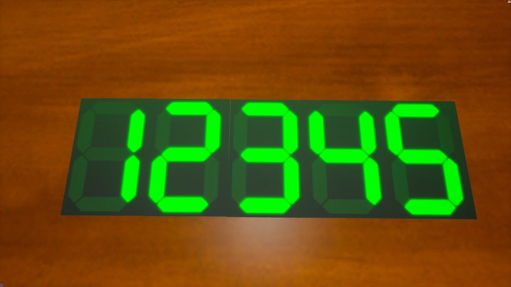

# Scripted Counter Optimized

This is a mod for [Tabletop Playground](https://tabletop-playground.com/), implementing an object that displays one digit, 0 through 9, which can be connected to adjacent copies of the same object to make a multi-digit counter, numerical input, or display.

## Screenshots

## Installation

This mod can be installed [via mod.io](https://tabletopplayground.mod.io/scripted-counter-optimized).

To use the version from this repo, you will need to run `build.sh` in `Scripts/` to compile from Typescript to Javascript, which will create the `Scripts/counter.js` that the game expects. The whole mod folder will then need to be placed in `TabletopPlaygound/TabletopPlayground/PersistentDownloadDir/` to make it available to the game.

## Usage

A single counter spawned into the game will allow you to cycle through the numbers 0-9 using the "primary" and "secondary" action buttons as defined in your game settings. You can also type in a number with your cursor over the counter and that number will appear.

Spawning a second counter and snapping it into position adjacent to the first will create a two-digit counter with a range of 0 to 99. Each digit can be incremented/decremented separately, and will carry/borrow to higher digits, and typing a number on any single counter will set the whole row of counters to display that number.

This can be repeated to create 3+ digit counters.

Moving groups of counters at the same time is not currently supported.

## History

Discussion on the Tabletop Playground Discord between the names below and some others led to the creation of this mod.

[Ghetto Counter](https://tabletopplayground.mod.io/ghetto-counter) by [Wodysus](https://mod.io/members/wodysus) was the first creation, simply demonstrating a ten-digit counter object.

[Scripted Ghetto Counter](https://tabletopplayground.mod.io/scripted-ghetto-counter) by [0x40](https://mod.io/members/1583229546) came next, implementing increment and decrement of neighbors as brainstormed on Slack.

The first and later versions of this repository, by [Sparr](https://github.com/sparr), improved and eventually replaced the scripting to be more efficient and add more functionality.